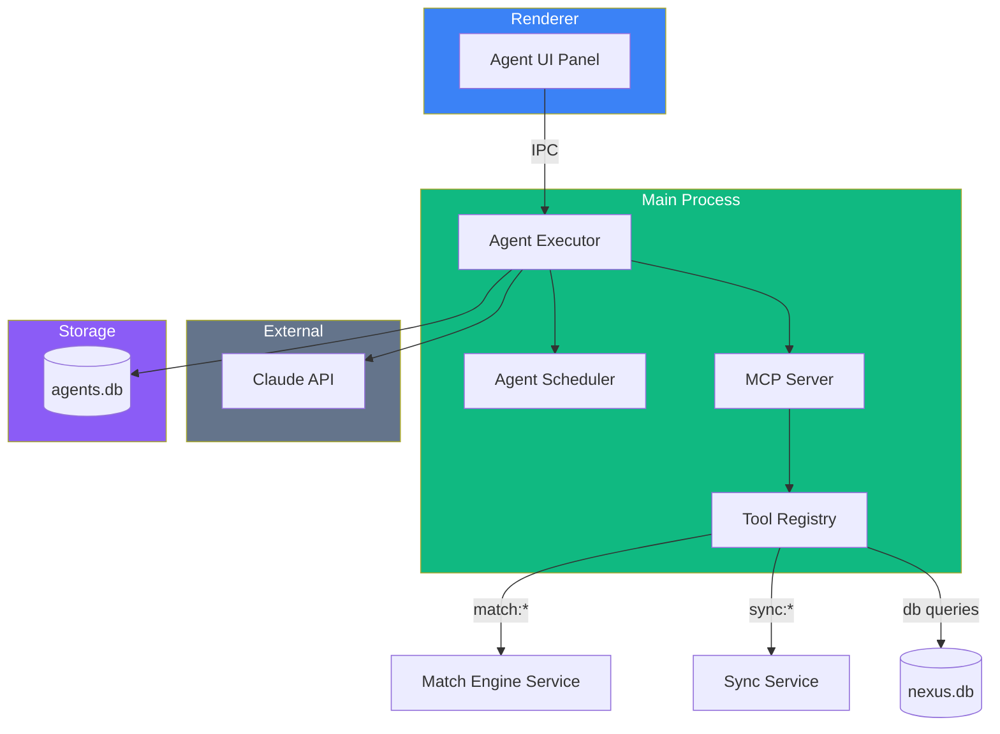

# 🤖 Agent Architecture

## Overview

Operation Nexus integrates AI agents built on the **Claude Agent SDK** and **Model Context Protocol (MCP)**. Agents run in the Electron main process and communicate with the renderer via typed IPC channels.

## Agent System Diagram

## Key Components

| Component | File | Purpose |
|-----------|------|---------|
| Agent Executor | `*Executor.ts` | Orchestrates agent runs with Claude |
| Agent Scheduler | `*Scheduler.ts` | Schedules and triggers agent runs |
| MCP Server | `*McpServer.ts` | Exposes tools via MCP protocol |
| Tool Registry | Various | Defines available tools for agents |

## Agent Types

| Agent | Purpose | Status |
|-------|---------|--------|
| [[Scout9 Agent]] | Autonomous candidate-to-opportunity matching | In Progress |
| Vigil Agent | Monitoring and alerting | Planned |
| Nomicore Agent | Named entity recognition and categorization | Planned |

## Data Flow

1. **Trigger** — User initiates agent run or scheduler fires
2. **Execute** — Agent executor sends prompt + tools to Claude
3. **Tool Use** — Claude calls MCP tools (match search, DB queries, etc.)
4. **Results** — Agent executor collects results, stores in `agents.db`
5. **Display** — Results streamed to renderer via IPC events

## Related
- [[System Overview]]
- [[Scout9 Agent]]
- [[Stakeholder Brain Map]]
- [[IPC Channel Map]]
