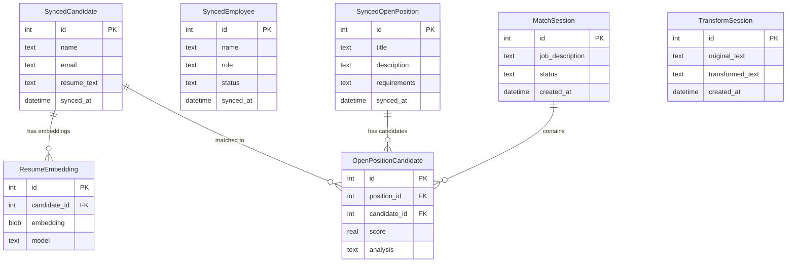

# 🗄️ Database Schema

## Database Files

| Database | File | Schema Source | Purpose |
|----------|------|---------------|---------|
| Nexus | `nexus.db` | `src/main/db/schema.sql` | Core data — candidates, positions, matches |
| Path | `path.db` | `src/main/db/path/schema.sql` | Career path and learning |
| Agents | `agents.db` | `src/main/db/agents/schema.sql` | AI agent sessions and results |

All stored at `app.getPath('userData')`.

## Entity Relationship Diagram

## Key Tables (nexus.db)

| Table | Purpose |
|-------|---------|
| `synced_candidates` | Candidates synced from upstream HR |
| `synced_employees` | Employees synced from upstream HR |
| `synced_open_positions` | Open positions from upstream |
| `resume_embeddings` | Voyage AI vector embeddings (sqlite-vec) |
| `match_sessions` | Match session metadata and history |
| `open_position_candidates` | Match results linking positions to candidates |
| `transform_sessions` | Resume transformation session data |

## Migrations

Shared `migrationRunner.ts` module handles all three databases:
- **nexus**: `src/main/db/migrations/` (12 migrations, 002–012)
- **path**: `src/main/db/path/migrations/`
- **agents**: `src/main/db/agents/migrations/` (9 migrations, 002–009)

Migrations are `.sql` files discovered by version prefix, executed in transactions, and tracked in per-database `migrations` tables.

## Vector Search

Uses `sqlite-vec` extension for vector similarity search on resume embeddings:
- Model: `voyage-4-large`
- Dimensions: 1024
- Stored as BLOB in `resume_embeddings` table
- Queried via `vec_distance_cosine()` function

## Related
- [[System Overview]]
- [[Data Sync Pipeline]]
- [[Match Engine]]
- [[ADR-001 SQLite over PostgreSQL]]
