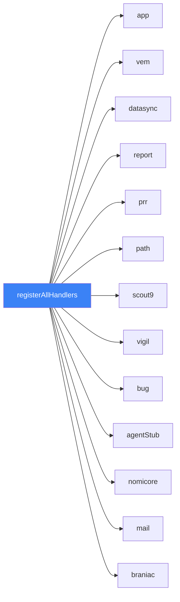

# 📡 IPC Channel Map

## Overview

All IPC channels are defined as constants in `src/shared/ipc-channels.ts` (~244 channels). Handlers are organized into 13 registrar groups registered via `registerAllHandlers()`.

## Registrar Groups

## Key Channel Domains

| Domain | Handler File | Purpose | Key Channels |
|--------|-------------|---------|--------------|
| `sync:*` | `sync.ipc.ts` | Token validation, data sync | `sync:validate-token`, `sync:start`, `sync:status` |
| `processing:*` | `processing.ipc.ts` | Resume extraction & vectorization | `processing:extract-text`, `processing:vectorize` |
| `match:*` | `match.ipc.ts` | Match engine operations | `match:search`, `match:session`, `match:pool-counts` |
| `database:*` | `database.ipc.ts` | DB sharing/export/import | `database:export`, `database:import` |
| `sessions:*` | `sessions.ipc.ts` | Transform session CRUD | `sessions:create`, `sessions:list`, `sessions:get` |

## Streaming Event Channels

9 streaming channels for real-time progress updates from main → renderer:

| Channel | Purpose |
|---------|---------|
| `sync:progress` | Data sync progress events |
| `match:pipeline-progress` | Match pipeline stage updates |
| `match:pipeline-stats` | Running statistics during matching |
| `processing:progress` | Text extraction progress |
| `processing:vectorize-progress` | Embedding generation progress |

## Renderer Service Mapping

| Renderer Service | IPC Domain |
|-----------------|------------|
| `dataSyncService.ts` | `sync:*` |
| `resumeProcessingService.ts` | `processing:*` |
| `matchEngineService.ts` | `match:*` |
| `sessionService.ts` | `sessions:*` |
| `databaseSharingService.ts` | `database:*` |
| `benchBurnService.ts` | `match:*` |

## Adding New Channels

See [[Adding a New IPC Channel]] for a step-by-step guide.

## Related
- [[System Overview]]
- [[Adding a New IPC Channel]]
