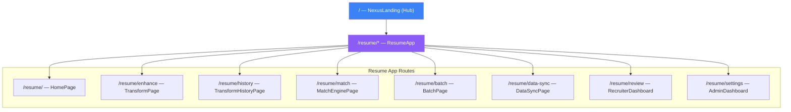

# 🌐 Multi-App Hub Pattern

## Overview

Operation Nexus uses a **hub-and-spoke** architecture where the main landing page (`NexusLanding`) serves as a hub with cards linking to independent sub-applications.

## Routing Structure



## Key Principles

1. **HashRouter** — Uses `#` routing for `file://` compatibility in Electron
2. **Independent sub-apps** — Each app has its own routes, components, services, and types
3. **Shared components** — Global components in `src/renderer/components/`
4. **Shared context** — `ThemeContext` spans the entire app

## Adding a New App

See [[Creating a New App Route]] for a step-by-step guide.

## File Structure

```
src/renderer/
├── hub/                    # Hub landing page
├── apps/
│   └── resume/             # Resume sub-application
│       ├── pages/          # Route-level page components
│       ├── components/     # Feature-specific components
│       ├── services/       # IPC service layer
│       ├── types/          # Domain types
│       ├── data/           # Mock data
│       └── utils/          # Utilities
├── components/             # Shared global components
└── contexts/               # Shared contexts (ThemeContext)
```

## Related
- [[System Overview]]
- [[Creating a New App Route]]
