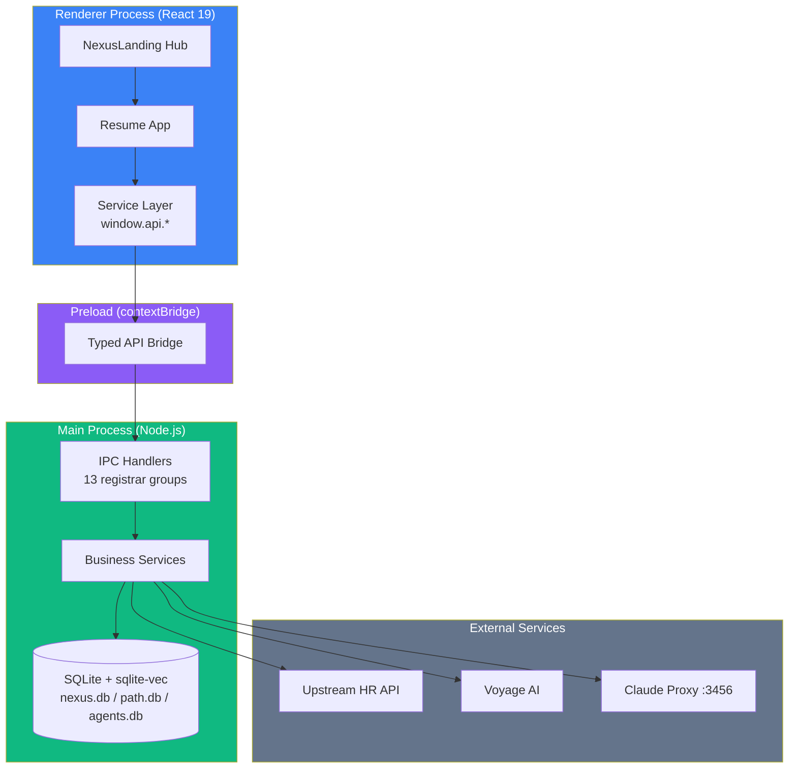

# 🏗️ System Overview

## Tech Stack

| Layer | Technology |
|-------|------------|
| Framework | Electron 40.0.x (Chromium 144, Node 24) |
| Build Tool | electron-vite 4.x |
| Frontend | React 19.2.x + TypeScript |
| Styling | Tailwind CSS + Glassmorphism design system |
| Database | SQLite (better-sqlite3 12.8+) + sqlite-vec |
| AI Embeddings | Voyage AI (voyage-4-large) |
| AI Scoring | Claude via local proxy (Haiku + Sonnet) |
| Agent SDK | @anthropic-ai/claude-agent-sdk + @modelcontextprotocol/sdk |
| Packaging | Electron Forge 7.x |
| Testing | Vitest + Playwright |

## Architecture Diagram

## Process Architecture

The app follows Electron's multi-process model with strict isolation:

- **Renderer Process** — React UI running in Chromium. No direct Node.js access.
- **Preload Script** — Typed `contextBridge` exposing `window.api.*` methods.
- **Main Process** — Node.js services, SQLite database, external API calls.
- **IPC Layer** — ~244 typed channel constants across 13 registrar groups + 9 streaming channels.

## Security Model

| Setting | Value | Note |
|---------|-------|------|
| `contextIsolation` | `true` | Never disable |
| `nodeIntegration` | `false` | Never enable |
| `sandbox` | `true` | Keep enabled |
| `webSecurity` | `true` | Never disable |
| IPC validation | `validateSender(event)` | Required first line in all handlers |

## Database Architecture

Three isolated SQLite databases:
- **`nexus.db`** — Core data (candidates, positions, matches, sessions)
- **`path.db`** — Career path and learning data
- **`agents.db`** — AI agent sessions and results

All use the shared `migrationRunner.ts` for versioned SQL migrations.

## Related
- [[IPC Channel Map]]
- [[Database Schema]]
- [[Multi-App Hub Pattern]]
- [[Agent Architecture]]
